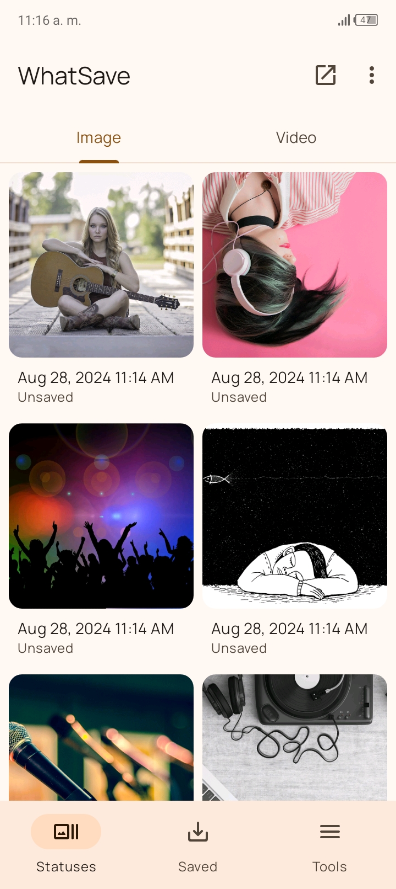
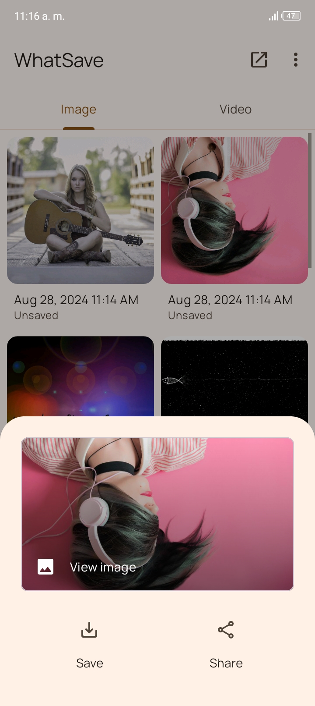
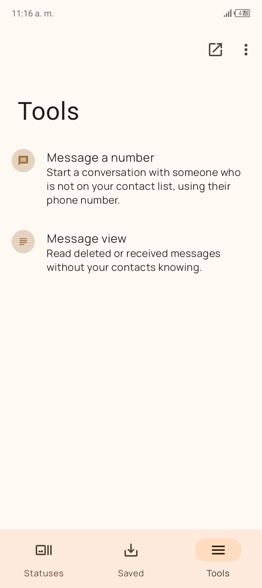
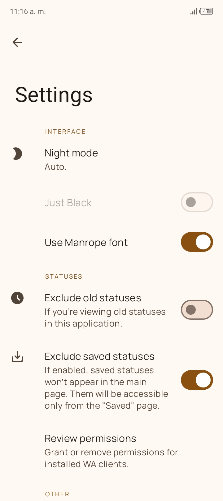
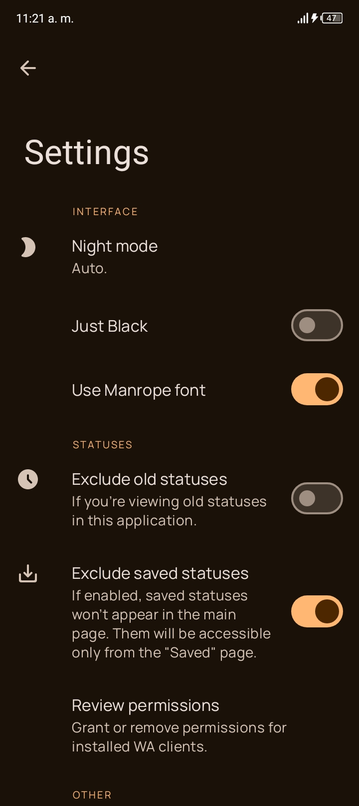

# Satus Saver - WhatsDelete

### An application that helps you save Whatsapp & Business statuses in the easiest way.

English
&nbsp;&nbsp;|&nbsp;&nbsp;
[Español](README-es.md)

## 📱 Screenshots

## 📃 Features:

* Supports all Android versions starting from 7.0 Nougat
* Material You on Android 12+
* Preview and save files
* Chat without saving the number
* Recover deleted messages
* Night mode
* Black theme
* No ADs
* No watermark
* It's free!

## 🤝 Contributing
If you are interested in contributing to this project, thank you! You can read the [CONTRIBUTING](CONTRIBUTING.md) file for details.

## 🔏 Privacy and Terms
Please see the [PRIVACY](PRIVACY.md) file to learn more about our Privacy Policy and Terms of Use.

## ⚖️ License details
WhatSave is licensed under the [GNU General Public License, Version 3.0](LICENSE.md). Any fork of
this project is requested to maintain the same license as per the law.

## ⚠️ Disclaimer
This application and its developer do not have any relationship or agreement with other companies or trademarks.
